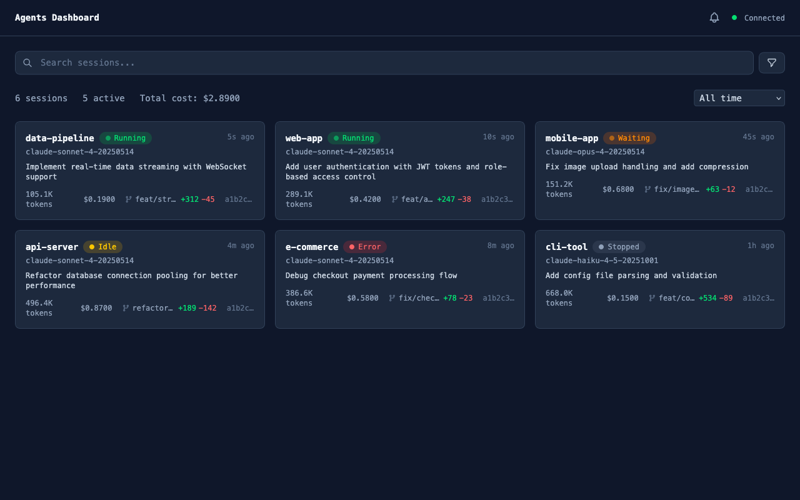
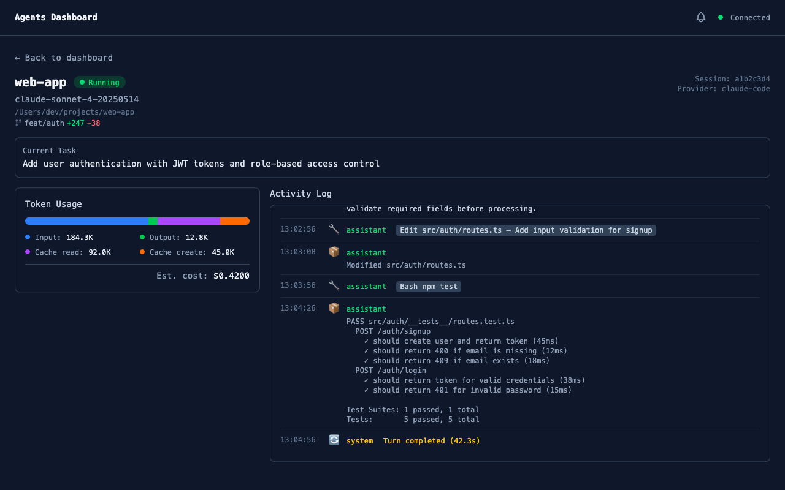

# Agents Dashboard

Real-time monitoring dashboard for AI agents — tracks Claude Code sessions via JSONL log files.





## Features

- Automatic discovery and real-time monitoring of Claude Code sessions
- Session state tracking (Running / Idle / PermissionWaiting / Error / Stopped)
- Token usage and cost calculation
- Real-time updates via WebSocket
- Simultaneous monitoring of multiple sessions

## Tech Stack

| Layer | Technology |
|-------|------------|
| Backend | Rust (axum + tokio) |
| Frontend | SvelteKit 5 + Tailwind CSS 4 |
| Shared | TypeScript types (auto-generated from Rust) |
| Package Manager | Bun workspaces |

## Prerequisites

- [Rust](https://rustup.rs/) (Edition 2021)
- [Bun](https://bun.sh/)
- [Claude Code](https://claude.ai/code) installed

## Getting Started

```bash
# Install dependencies
bun install

# Generate TypeScript types from Rust schemas
bun run gen:types

# Start dev servers (backend + frontend)
bun run dev
```

Backend runs at `http://localhost:3001`, frontend at `http://localhost:5173`.

### Custom Ports

You can change the backend port with the `PORT` environment variable, and tell the frontend where to connect with `VITE_API_PORT`:

```bash
# Run backend on port 4000
PORT=4000 bun run dev:backend

# Tell frontend to connect to backend on port 4000
VITE_API_PORT=4000 bun run dev:frontend
```

## Commands

```bash
bun run dev              # Start both backend + frontend
bun run dev:backend      # Backend only (Rust/axum, port 3001)
bun run dev:frontend     # Frontend only (Vite, port 5173)
bun run build            # Build all packages
bun run test:backend     # Run Rust backend tests
bun run gen:types        # Generate TS types from Rust schemas
```

## Disclaimer

This is an unofficial personal project and is not affiliated with, endorsed by, or supported by Anthropic. This software is provided "as is", without warranty of any kind. Use at your own risk.

## License

MIT
